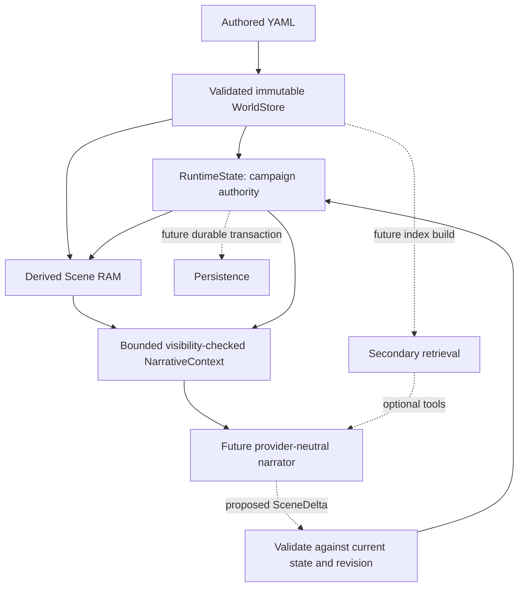

# Phase 1E.2 — Architecture, Scope & Canon Audit

Date: 2026-09-27. Engineering conclusion after the corrective changes: **GO** for
the next explicitly authorized foundation phase, not for live persistent gameplay.

The architecture remains a deterministic state engine supporting a flexible
narrator. No major rewrite is currently necessary. One reproducible validation
defect was fixed; documentation and selected tests were corrected. No canon,
retrieval, provider, coordinator, persistence, UI, or new world system was added.

## A. Current implementation map

The review covered the source, production YAML, seven templates, all test files,
README, architecture/schema/authoring documents, package manifest/lock, TypeScript
configuration, and reserved directory layout. Installed dependencies and generated
build output were treated as artifacts rather than project implementations.

| Area | Actually implemented | Not implemented |
| --- | --- | --- |
| Canon | 46 entities: 24 locations, 15 world_lore, six factions, one concept; zero chunks | Characters, items, events, detailed history/cultures/religion |
| `src/types/` | Seven entity variants; chunk envelope; SceneState/SceneDelta; primary context; provider-neutral Narrator contract | Durable campaign snapshot, campaign event/memory model, tool schemas |
| `src/world/loader.ts` | Deterministic recursive YAML loading, parse restrictions, full validation | Incremental/hot reload, dataset version manifest |
| `src/world/validation.ts` | Shapes, IDs, filenames, refs, ownership, same-type parent cycles, item-container cycles | Gameplay lifecycle/rules validation beyond supported deltas |
| `src/world/world-store.ts` | Cloned/deep-frozen private entity/chunk maps, ID lookup, ancestry, children, type selection | Alias resolver, index enumeration/provenance contract, retrieval |
| `src/world/runtime-state.ts` | Separate player location/time/mana, NPC locations, revision, atomic delta application | Save/restore, inventory, lifecycle, relationships, location overrides |
| `src/scene/` | Scene RAM, unknown-input delta validation, bounded visibility-checked NarrativeContext | Turn orchestration, navigation policy, secondary context selection |
| `src/dev/` | Read-only inspector using production projection | Game loop or frontend |
| `src/core/`, `src/retrieval/`, `src/llm/` | Intentionally reserved directories | No hidden implementation in them |
| Tests | Structural negatives, isolation, deltas, mana, visibility, authoring manifests, CLI, geography | Real model, storage, search, or performance benchmarks |

`data/characters/`, `data/items/`, `data/events/`, and reserved world history,
cultures, and religion directories remain empty. The Church is a faction, not a
partially implemented theology system. Synthetic NPCs and old `l1` IDs exist only
in test fixtures and documented historical examples. They do not enter production.

## B. Final architecture map

WorldStore does not become mutable when campaigns change. The arrow to runtime
means initialization/reference validation, not copying all canon into campaign state.
Scene RAM is derived internal data, not a competing authority or model payload.

A future turn can read a restored campaign, build primary context, invoke a
narrator with bounded tools, validate its proposal, commit, persist, and then publish
narration/UI state. Current components support the middle deterministic portion.
Missing pieces are explicit restore, tools/indexes, provider output parsing, prompt
composition, coordinator policy, durability, and retry/idempotency handling.

Publishing narration must wait until commit and durable acceptance succeed.
Otherwise prose can claim changes that were rejected or lost. A stale proposal
must trigger controlled recontextualization/retry or an error, not publication of
the original narration. This sequencing is a future coordinator requirement.

## C. Canon consistency findings

**Canon defines what exists and its baseline nature. Runtime defines what has
happened to it in this campaign.**

No confirmed contradictory fact, duplicate city, broken reference, or accidental
campaign-state record was found. Production YAML was not changed during this audit.
All 46 records have explicit narrator/player visibility true and empty `known_by`.
This is access eligibility, not proof every fictional person knows every fact.

Cases specifically reviewed:

| Case | Finding |
| --- | --- |
| LR hearth | Illumination is conditional on being lit; no current fire state is asserted |
| CY medicinal areas | Initially empty is an explicitly supplied baseline, not live plant inventory |
| F1 beds/wardrobes/cabinets | Capacity and initial emptiness do not establish patients or current contents |
| U1 partly used storage and lower stairs | Baseline use and incomplete knowledge; no hidden destination, treasure, or occupant is invented |
| East neutrality and Blackwater autonomy | Supplied political baselines, not campaign consequences; future changes need runtime overrides |
| Mana lore | Numeric baseline/rules and consistency anchors, not the current pool or fixed spellbook |
| Slavery network | Descriptive social/economic canon; no shipments, counts, or mandatory route simulation |
| Merchants Guild “No monopolies” wording | In context concerns guild powers, while city-level slave-market control is established elsewhere; potential editorial ambiguity, not grounds to invent guild control or rewrite canon |

Stable identity is coherent: filenames match lowercase snake_case IDs; all refs
resolve; names can change independently. `main_city_structure` retained its ID when
named for Calderan. There is no Caldrevan or Merovar city entity to migrate.
West/Center/East nations have distinct IDs, continent parents, nation-qualified
display names, and disambiguating search context. Districts are lore themes only.
Repeated case variants of a name on the same Heartstone entity are not duplicate
identities. Future name/alias lookup must return candidates, never pick arbitrarily.

Existing containment is continent → three nations → ten cities; the range is
under continent. Four surrounding waters and Heartstone have null parents. Heartstone
has LR, CY, U1, and F1 children. Waters are not wholly inside the landmass; the range
crosses a national transition; these parents are reasonable. CY's association with
the residential property is consistent with established Heartstone containment.
Blackwater under West is geographic containment, explicitly not effective control.

Missing districts and Heartstone city placement are intentional. Future
`calderan_west`, `calderan_east`, `calderan_north`, `calderan_south`, and
`calderan_center` can use `parent: calderan`. Once placement is actually supplied,
Heartstone can change parent without changing its own or its children's IDs.
That authoring revision must be reflected in future dataset/save provenance; it
must not be guessed now. F2–F6 remain unauthored.

Exactly six directed connections describe LR ↔ CY, LR ↔ U1, and LR ↔ F1. All new
geographic connections are empty. Parent links, national borders, and commercial
route mentions do not generate traversal edges. Directed edges remain suitable
for future asymmetric access; no redesign is justified.

Granularity is healthy for current retrieval goals:

| Records | Assessment |
| --- | --- |
| LR/CY/U1/F1 | Furniture and functional zones remain features; no child-room or item explosion. Promote a feature only when independent identity/state is actually needed |
| Blackwater/Davenport/Ironbound/Frostspire | Compact independent city identities; physical and institutional features support queries without splitting every fact |
| Calderan/Khar-Dune/Sandspear | Established civic/market/corsair pressures, not scheduled plots or complete government models |
| Zul-Rath/Vaelrost/Skardgard | Deliberately limited capitals/coastal identity; no unsupported rulers, supernatural architecture, or fleet sizes |
| Magic | Five coherent topics; content ranges 216–1294 UTF-16 units. No files per element or illustrative subschool |
| Peoples | Six short records, 137–614 units. Shortness is justified by distinct identities and thin supplied canon; merging would not improve normal-turn latency |
| Fundamentals | Four records, 1056–1436 units; city themes, governance, continental overview, and slavery remain distinct retrieval topics |
| Factions | Six independent actors; national guilds, Church, its Inquisition child, and local City Guard are sensible. Magistracy remains a concept |

`continent` supplies physical identity and parentage; `continental_structure`
supplies a cross-regional climate/politics overview and related IDs. There is some
intentional orientation overlap, but they are different retrieval/use units. Do
not merge their IDs. The same city rivalry in both cities is useful local context,
with a future maintenance risk rather than present contradiction.

No chunk duplication exists because production has zero chunks. No current content
requires forced chunking. The longest introduction is `main_city_structure` at
1436 units. Avoid padding short entries or fragmenting them just to populate fields.

## D. Core architecture findings

**WorldStore.** ID/chunk lookups use maps; records are detached by structured clone
and recursively frozen. Source ordering is deterministic. Ancestry follows explicit
parents, with cycle validation and defensive checks. `getChildren` and
`getEntitiesByType` scan all entities; they are not precomputed indexes. They are
fine for present setup/inspection, but should not become repeated search hot-path
operations. No mutating API exists. The JavaScript instance/methods are not a security
sandbox; only trusted engine code should receive them.

**Current fix: sparse/non-data programmatic canon.** Before this audit,
`new WorldStore(...)` accepted a location with `features: new Array(1)`: `forEach`
skipped the hole. Similar holes could bypass other list checks. The validator now
requires dense arrays and plain enumerable data records, rejects array extensions
and accessors, and reads diagnostic identity through a descriptor without invoking
an ID getter. Regression tests reproduce holes in features, aliases, references,
and chunks. This closes an existing validation gap without changing valid YAML or
the entity schema. It is not an attempt to sandbox malicious proxies/executable JS.

**RuntimeState.** Private state holds only location/time, NPC locations, mana, and
revision, plus the WorldStore reference. Inputs are copied, outputs frozen, and
commits prepare detached state before private assignments. No async gap exists
between validation and commit. One changed transaction increments revision once;
no-op/rejection leaves it unchanged. Safe-integer checks protect time/revision and
mana. Unguarded local deltas remain intentionally allowed; external narrator turns
must require the revision captured with their context at the future adapter boundary.

**SceneDelta.** Five optional proposal sections are still small enough. Keep typed
sections and extract pure validate/prepare functions as actual new state domains
arrive, with one final transaction coordinator. An operation list becomes worthwhile
only when ordered/repeated operations are necessary; replacing the current format
now would be speculative. Errors carry field and optional entity ID. The receipt
still reports movement/time only: a successful mana-only change resembles a no-op
receipt. Documentation now explicitly says to inspect revision/mana, not infer
whole-transaction change from receipt fields. Future persistence needs a full
versioned commit/snapshot contract, not this receipt as an event log.

**Movement boundary.** Runtime validates destination identity/type, not route
adjacency or narrative permission. It can move between valid disconnected locations.
This does not create a canonical connection. It is a documented foundation limit,
not proof that every model-proposed journey is legitimate. Decide movement policy
before a player-facing coordinator; do not invent routes or force adjacency now.

**Scene RAM.** It computes exact-location NPC presence and ancestor records. It
shares frozen full canon internally and does not evaluate visibility. It is small
in responsibility, although raw records are not a bounded narrator payload. Mana
is not duplicated there; NarrativeContext reads the authoritative frozen pool.

**NarrativeContext.** Allowlisted current-location content/features, ancestor
summaries, time, mana, revision, and visible present NPCs only. No sibling, neighbor,
connection target, faction, lore, or chunk expansion. Text limits are UTF-16 units,
not token counts: content 2000, summary 600, feature description 400; at most 24
features/traits/present NPCs, 16 visible ancestors, and 16000 projected text units.
Over-budget context fails explicitly, with no silent truncation. A future crowded
scene needs an explicitly designed selection policy, not raised limits by accident.

**Mana and time.** Defaults remain 100/100; signed explicit safe-integer deltas must
stay within bounds before recovery. Then each crossed 1440-minute day adds 25 up to
maximum. The rule is deterministic and internally consistent: advancing time cannot
rescue an overspend. It describes explicit mutation before elapsed-time recovery;
future ordered action timelines can use separate transactions if needed. Multiple
days, zero-time calls, cap, zero-capacity initialization, negative starting minutes,
large safe values, and rollback are covered. Sleep has no role. The recovery product
remains safely below the integer limit for the allowed clock increments, and adding
only remaining capacity avoids pool overflow. No change to this policy is warranted.
Keep monotonic signed world minutes authoritative; future day/date/season/year labels
can derive from a chosen epoch/calendar. Restore must not award historical recovery.

**Knowledge.** Missing primary policy throws; narrator-hidden records are omitted
before projection; narrator-visible/player-hidden records receive `secret: true`.
`known_by` is validated NPC metadata, not presence or inferred belief. Chunks may
override owner policy, but access evaluation for secondary chunks is only documented,
not implemented. A public chunk of a restricted owner must not leak that owner's
restricted metadata during future indexing. Raw `getEntity/getChunk` are trusted
engine APIs and must never be exposed directly as model tools. A secret marker does
not guarantee a model cannot disclose it. Undefined U1 lore has no invented secret
answer; missing information and hidden information remain different.

**Errors/determinism.** WorldValidationError (source/entity/field),
SceneDeltaValidationError (field/entity), and NarrativeContextError (field/entity)
are adequate for local diagnostics. Staleness and malformed revision share a class
and field; stable reason codes are desirable before automated retry policy. Missing
ID lookup returns undefined; hidden primary records are omitted rather than errors;
initialization/internal defensive errors are generic. Do not parse human messages
as a permanent orchestration protocol. No randomness, wall-clock progression, or
network operation is present in core state transitions. Deterministic sequence tests
now compare both accepted commits and rejected state across two runtimes.

## E. Retrieval readiness

The source schema is ready for derived indexing. It preserves all requested ID,
name, alias, type, parent, summary, content, tag, feature, and structured relationship
material, plus entity/chunk ownership and sections. No vectors, scores, generated
search text, or index IDs are stored in canon. Empty `search_context` is valid and
appropriate in 35 of 46 records: ordinary faction, race, magic, water, and city
records already contain their vocabulary. It adds value for nation/district
disambiguation and colloquial Heartstone descriptions, not as a required SEO field.

Before implementation, define these bounded interfaces (design only):

- Read-only index source: enumerate entities and all chunks, including source path
  and canonical dataset revision/hash. WorldStore currently discards source paths
  and cannot enumerate its private chunks; exact `getChunk(id)` alone is insufficient.
- Candidate resolver: exact ID, then exact name/alias producing zero/one/many
  candidates; never implicit first-match alias resolution.
- `world_search`: validated query/compatible filters plus audience context; bounded
  ID/type/summary results, optional chunk ID, ranking score, source provenance.
- `world_get`: exact entity/chunk ID with the same policy checks, bounded passage
  and provenance. Distinguish missing, denied/unclassified, and tool failure without
  leaking hidden metadata in user-facing results.
- Runtime filter view: accepted locations and, later, placement/lifecycle state at
  a defined revision. Do not index authored NPC spawn as its permanent current location.

Begin with exact resolution and metadata; add lexical/BM25 only when useful, then
semantic similarity and hybrid ranking based on evaluation. Load/build indexes
outside ordinary turns. The normal target remains zero retrieval calls; lore-heavy
turns usually use one search plus zero/one exact fetch. Two searches is a ceiling,
not a requirement. Candidate summaries, fetches, and duplicate content need a shared
budget. Current granularity supports this; it does not require record-by-record loops.

Capitals, borders, and rivalry currently use feature text, not machine-typed edges.
Text indexing can retrieve them now; exact relational querying would need a future
deliberate schema extension or derived mapping. Do not pretend they are validated
ID refs or overload traversal connections. No current need warrants a graph redesign.

## F. Future LLM readiness

`Narrator.narrate({context, user_message})` and `{text, scene_delta?}` are provider
neutral and useful as the final semantic boundary. They are not yet a transport,
tool-loop, streaming, or response-validation interface. Put OpenRouter behind a
future NarratorProvider abstraction with cancellation/deadline, tool schemas,
structured output parsing, usage reporting, and bounded retry/error handling.
Do not make WorldStore or RuntimeState provider-aware.

Prompt composition should be stable instructions + persona + NarrativeContext +
bounded recent conversation/continuity + selectively retrieved passages. No final
prompt was authored. Core prompt, persona, primary scene, recent conversation,
secondary lore, and output reserve need separate budgets. Character guards are
useful safety bounds but cannot replace provider token accounting.

Measured serialized contexts at minute/revision zero, with no NPCs:

| Location | Projected text units | Compact JSON characters |
| --- | ---: | ---: |
| Heartstone LR | 4442 | 5217 |
| Heartstone CY | 2604 | 3234 |
| Heartstone U1 | 2514 | 3086 |
| Heartstone F1 | 2159 | 2586 |
| Calderan | 1664 | 2157 |
| Blackwater | 1940 | 2462 |
| Davenport | 1686 | 2179 |
| Ironbound | 1466 | 1930 |
| Frostspire | 1380 | 1902 |

These are character measurements, not tokenizer estimates or performance benchmarks.
The current contexts fit a modest primary-scene allocation. World growth does not
automatically increase prompt size: a new regression adds 300 unrelated locations
and obtains exactly equal context. Changes to actual ancestors/present NPCs can
increase primary size, subject to existing bounds.

Likely future turn costs are storage access, primary projection, model inference,
optional tool/model round trips, commit, and durable write. Avoid parsing YAML or
building indexes each turn; the inspector deliberately does that for development,
not as a production-loop example. Current NPC snapshot sorting is O(N log N), scene
presence filtering O(N), and each delta copies the NPC map O(N), even for mana-only
changes. These are real scaling considerations, not current latency failures. Add
derived location indexes or selective preparation only after measuring campaign size.
No per-turn multi-agent loop or mandatory query embedding is warranted.

## G. Test-suite findings

Baseline: 213 tests. Final verification is recorded in M. Count is not a quality metric.

| Test group | Disposition |
| --- | --- |
| World validation/loader | Kept malformed YAML/ref/cycle/type/item tests; expanded the existing production-load integration test rather than adding another integrity authority |
| Production integrity | Replaced hardcoded 24-location count with actual file/loaded-ID agreement, explicit policies, chunk lookup/classification, and template exclusion; production loader remains reference/shape authority |
| Runtime/scene deltas | Kept primitive/transaction separation, exact presence, rollback, revisions, input/snapshot isolation, and unknown-field/accessor negatives |
| Mana | Kept numeric initialization, bounds, stale proposals, combined commits, multi-day/negative-time/cap tests; policy order is contractual |
| Narrative context | Kept visibility/size/allowlist/mocks; added unrelated-world-growth regression |
| Authoring | Replaced U1 whole-description equality and F1 long sentence/order regexes with individual fact cues and named-feature lookup; retained capacity/emptiness/unknown-destination coverage |
| Geography | Retained explicit membership, capitals, borders, aliases, rivalry and feature facts; renamed a misleading negative test to describe its actual structural coverage |
| CLI/templates | Kept production-projection equality, deterministic output, no file writes, errors, and all seven separate template types |

Added eight tests: five parameterized sparse/extended-array rejection cases, one
accessor/identity safety case, one world-growth case, and one deterministic delta
sequence case. No test case was blindly deleted. Existing YAML-isolation coverage
now also exercises explicit mana and daily recovery. Renamed the obsolete
“Heartstone-only world” test and the context test omitting mana from its name.

Remaining editorial tests match feature labels and some small prose cues, because
those facts have no richer typed fields. They are canon review tripwires, not a
semantic proof. Long LR layout regexes and phase-specific rosters still need edits
when authorized canon changes; keep that maintenance localized. Negative word
searches can reject a harmless negated mention and cannot detect every invented fact.
The geography field allowlist test previously overstated what it proved; it now
explicitly acknowledges that structural checks cannot validate arbitrary prose.

Some production loads repeat across focused tests; that is acceptable integration
coverage at this scale. Do not remove different boundary checks solely because
they observe the same fixture. Generated `.build` is not cleaned by `tsc`, so deleting
or renaming source tests can leave stale compiled tests; use a clean build artifact
directory for such changes/CI. This audit renamed no test files.

Required invariant coverage is present: canon/YAML isolation, frozen runtime
snapshots, one revision per changing commit, atomic rejection, missing/hidden policy,
exact NPC presence, player distinction, explicit hierarchy vs connections, primary
context bounds, mana rules, geographic control/containment distinction, and template
exclusion. Connection tests verify authored knowledge, not route enforcement.

## H. Documentation drift corrected

- README and RETRIEVAL no longer suggest passing raw Scene RAM to the model;
  NarrativeContext is the explicit boundary, with the zero/one-search target clarified.
- PHASE_1_DECISIONS now reflects 1E/1E.1 and this checkpoint, implemented numeric
  validation, and the still-unimplemented lifecycle validator rather than implying it exists.
- ENTITY_SCHEMA describes implemented safe-integer and supported-delta validation.
- SCENE_RAM explains the separate mana authority; SCENE_DELTA_ENGINE explains why
  a mana-only change cannot be inferred from the movement/time receipt.
- RUNTIME_FOUNDATION documents dense/plain-data programmatic input requirements.
- Package description no longer labels the whole project as Phase 1A.

AUTHORING_GUIDE, GEOGRAPHY, seven templates, and chunk schema agree on optional
search cues, feature promotion, relative geography, unknown versus secret, and
baseline versus runtime. Earlier phase titles are historical provenance, not dead
APIs. No reserved directory or useful synthetic `l1` fixture was removed.

## I. Technical debt and future state domains

**Must fix now:** reproduced sparse-array/non-data validation gap and misleading
documentation/test claims were corrected. No remaining defect requires stopping
the next foundation phase. No live-service security or durability guarantee is claimed.

**Before the relevant phase:**

| Dependency | Needed before |
| --- | --- |
| Entity/chunk enumeration and dataset/source provenance; visibility-aware search/get contracts | Retrieval |
| Versioned runtime snapshot, validated restore preserving revision/NPC positions, canon compatibility policy | Persistence |
| Durable transaction/recovery semantics, concurrency checks and request idempotency | A persistent player-facing turn loop |
| Machine-readable error reasons, output validation, required guarded narrator proposals, movement policy | Provider/coordinator integration |
| Runtime overlays for lifecycle/knowledge/placements and NPC activation rules | NPC and mutable-world systems |
| Stable promotion/feature addressing for independently mutable furnishings | Object/continuity interactions |
| Token accounting, bounded conversation and secondary content | Production prompt composition |

Future runtime expansion should use separate typed domain snapshots and pure
prepare/validate functions, with RuntimeState or a small transaction owner committing
them together. Avoid adding every rule to one growing class. NPC baseline traits,
character relationships, lifecycle fields, faction membership, and knowledge exist
in schema; live mutations and memories do not. Runtime currently initializes all
NPCs with non-null locations regardless of lifecycle. Before authoring inactive/dead
NPC populations, define activation/presence semantics; do not assume lifecycle is
already enforced. Nicco remains separate through role checks and player location.

Relationships currently use kind/description edges, not numeric scores. Future
relationship state/summaries should be supported by separately retrievable memories
and events. Existing character relations allow only one edge per target; multiple
independent relation kinds would need an explicit later decision, not invented
score fields. Item placement already expresses one owner/location/container, but
unknown placement and campaign-created entities need explicit future lifecycle policy.

Scene continuity belongs in typed runtime overlays, never rewritten location YAML:
durable changes that survive absence/restart, shorter-lived scene facts with explicit
lifetime/promotion rules, and conversation history are distinct. Even ephemeral
continuity may need serialization to resume an interrupted scene. Feature names are
not permanent interaction IDs; promote or introduce stable addressing when needed.

`world/history/` is broad historical lore. `data/events/` describes discrete authored
occurrences with time/location/participants. Campaign events/memories belong in a
separate durable repository with their own identity/provenance and reference resolver;
they must not force appending mutable records into WorldStore. Event anchors remain
selective NPCs, while Nicco can be a participant. The schema is a useful starting
point, not an implemented campaign history store.

Persistence can store a versioned runtime snapshot plus durable generated records
without changing canon. It must include revision, time, mana, player/NPC locations,
future domain overlays, events and memories, and dataset identity. Current constructor
is initialization only: revision resets to zero and NPC locations reset from canon.
Do not restore by replaying movement/time methods or awarding elapsed recovery again.
Coordinate successful in-memory commits with durable writes before returning success;
simple “write sometime after commit” needs an explicit failure/recovery policy.

**Optional later:** optimize NPC sorting/map copies/type scans after measurement;
deduplicate repeated geographical orientation in retrieval results; add typed border
or capital metadata only if exact relational operations require it; clean build
automation; finer error taxonomy only where callers need it. No generic stats,
economy, tactical combat, or giant graph framework is justified.

Dependency review: runtime dependency is only `yaml` (lock 2.9.1); TypeScript 5.9.3,
Node type definitions 22.20.4, and transitive `undici-types` 6.21.0 are development
dependencies. Lockfile v3 contains resolved versions/integrity. Node >=22 matches
ES2022/NodeNext and the observed Node 22.23.2/npm 10.9.8 environment. Use `npm ci` for
reproducible installs. No package was added. This was a local dependency/scope review,
not a current vulnerability-advisory scan or claim of vulnerability absence. Git is
planned for canon history, but the workspace has no `.git`; future source provenance
cannot currently assume a commit hash exists.

## J. Recommended future roadmap

This is a dependency plan, not authorization to implement it.

| Order | Purpose and prerequisites | Architectural output | Defer | Main risk |
| --- | --- | --- | --- | --- |
| 1. Retrieval foundation | Existing validated canon; define source enumeration, provenance, audience policy, ambiguity and budgets | Read-only derived index source and exact/name/filter resolver | Embeddings, provider, runtime mutation | Leaking owner metadata or treating ambiguous names as IDs |
| 2. Bounded world_search/world_get | Foundation and representative queries | Validated candidate/fetch tools; lexical search if evaluation warrants it | Vector DB, autonomous multi-search loops | Excessive calls or stale runtime filters |
| 3. Snapshot/restore and persistence foundation | Stable runtime invariants; define dataset compatibility and errors | Versioned snapshots and validated restore, durable repository contract | Inventory/relationship systems, distributed server | Reset revisions, replay recovery, partially persisted commits |
| 4. Narrator provider adapter | Context and bounded tool contracts | Provider-neutral interface plus OpenRouter implementation, structured output validation, usage/deadline/retry policy | Campaign orchestration and unrestricted tools | Provider errors or malformed output bypassing validation |
| 5. Minimal turn coordinator | Tools, provider, durable commit semantics, movement policy | Guarded context → proposal → validation → durable commit → publish flow; idempotency | Full NPC simulation, additional stats | Narration/state divergence, stale retries, duplicate accepted turns |
| 6. Conversation and scene continuity | Usable turn pipeline and snapshot format | Bounded conversation, durable/ephemeral scene overlays with explicit lifetime | Automatic encyclopedic summaries | Lost same-scene facts or temporary facts becoming canon |
| 7. NPC/relationship/event memory | Identity/activation rules and continuity storage | Typed live NPC state and qualitative relationships with retrievable event/memory evidence | Numeric friendship systems, comprehensive social simulation | Unbounded memory expansion and contradictory authorities |
| 8. Minimal frontend/UI | Stable turn and resource/state API | Location, transcript, mana, errors, loading/cancel state | Map/navigation UI, decorative RPG systems | UI displaying uncommitted narration/state |

Provider work can proceed independently of storage once tool contracts stabilize;
the player-facing coordinator should wait for both. Persistence is placed earlier
than the sample roadmap to settle revisions, retries, and publish semantics before
they become accidental API contracts. Semantic/hybrid search is an evaluated later
extension, not a prerequisite for a usable narrator.

## K. Rewrite-risk assessment

No component currently demands a major rewrite. Ranked by likely engineering change:

1. **Runtime transaction/restore boundary — moderate extension risk.** Most likely
   current component to need internal restructuring when several mutable domains
   and durable commits arrive. Existing private snapshots and staged commit are a
   good base; extract domains and add restore instead of replacing canon/state design.
2. **Narrator interface — low/moderate extension risk.** Tool sessions, cancellation,
   streaming and usage are absent. Add a provider/session layer while retaining the
   final narration-plus-proposal contract.
3. **WorldStore retrieval access — low/moderate, localized.** Enumeration/provenance
   gaps block complete indexing but need additive read APIs or an index-source adapter,
   not mutable canon or rewritten files.
4. **Entity schema — low now, specific future decisions.** Feature identity,
   campaign-generated refs, multiple relationship kinds, and optional typed geography
   can evolve with versioning. No present migration is needed.
5. **SceneDelta, NarrativeContext, location hierarchy — low.** Small typed sections,
   bounded projection and permanent IDs remain appropriate. Crowded-scene selection
   and multi-operation ordering should be added only for demonstrated requirements.

Retrieval and persistence implementations do not yet exist, so they cannot honestly
be ranked as existing code requiring rewrite. Their missing contracts are dependencies.

## L. Scope and trust-boundary assessment

The project remains aligned with persistent, AI-driven, low-latency, emergent
narrative supported by deterministic state and selective retrieval. Persistence,
AI and retrieval are goals with deliberate interfaces, not falsely claimed features.
Canon provides places, institutions, pressures and possibilities. Blackwater/Sandspear
rivalry is an established tension, not a scripted encounter or predetermined outcome.
No Big Bad, required quest, fixed destiny, or mandatory war was found.

Future model output and tool arguments are untrusted data: parse and validate them,
enforce tool/audience/budget allowlists, and require expected revision at the external
turn boundary. The model receives neither filesystem/code execution nor direct
WorldStore/RuntimeState/persistence handles. A valid entity ID is not proof of
narrative authorization. Retrieved text is lore data, never higher-priority tool
instructions. Secrets need tool metadata filtering and safe output handling; current
visibility flags alone are not an end-to-end confidentiality guarantee.

No new canon, feature system, provider, search, persistence, coordinator, district,
NPC, inventory, relationship system, generic stat framework, or UI was implemented
in this checkpoint. No current design drifts toward an MMO, procedural generator,
economy simulator, or tactical combat engine.

## M. Final status and verification

**GO.** The reproduced current validation issue is fixed; the remaining significant
gaps are correctly scoped prerequisites for future phases. Primary context remains
bounded independently of unrelated world growth, state authority stays deterministic,
and existing canon/IDs can be retained as the engine grows.

Final verification: full `npm test`, TypeScript checking, and production context
inspection for `heartstone_lr`, `heartstone_f1`, and `calderan`. The final suite has
**221 passing tests**. No next phase was started. This decision approves architectural
readiness, not implementation permission or readiness to expose a persistent game.
