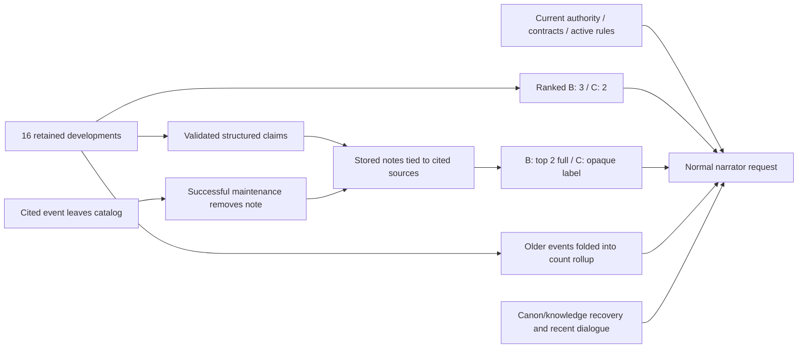

# D-09 Reflection Utility / Packing Role Review

2026-10-05, Europe/Rome. **Design/audit only. Paid calls: 0. Production changes: 0. D-09: SOAK PENDING.**

**Actual role: E, MIXED.** Event families can provide **bounded trajectory memory after compact history is displaced**, while current-contrast and self-statement notes are largely redundant summaries. Environmental notes mainly duplicate active policy while preserving a little historical metadata. This is not independent long-term compression memory: normal successful maintenance removes structured notes when any cited source disappears from the evidence catalog.

The architecture plausibly permits material benefit in a narrow aging/use window. Existing trials did not demonstrate that benefit: one environmental pair preferred WITHOUT; self synthesis duplicated permanent compact fields; the relationship attempt never created authority. **Another authority-creation soak is not justified.** One future A/B is justified only on a naturally existing, prequalified historical case, as specified below; no new live execution is authorized or performed by this review.

Evidence: `saves/d09-reflection-utility-review/`. Reproduction: `node scripts/d09-reflection-packing-review.mjs` after building. The script blocks `fetch`, uses diagnostic campaign branches and deterministic **local** reflection responses, and invokes the actual production validator, persistence/merge and packing functions. These authored offline state changes and local responses are **not live gameplay, provider realization or D-09 closure evidence**. All 406 production-source hashes remain unchanged.

## CURRENT NARRATOR INFORMATION SOURCES

Tier A is the never-drop authority projection, not an NPC+ fragment generated by `packNpcPlus`. B/C/D share the separate NPC+ budget. Canon retrieval is another path, not a search over reflection/history memory.

| Source | Information / retained history | Current state or trajectory | Priority / token cost | When ordinary context loses it |
| --- | --- | --- | --- | --- |
| Current scene, character profile/current record | Present identities, location, conditions, appearance, canon portrayal and equipment; **0 historical events** | Current authority | Tier A never-drop for present people. Representative character block: **84 estimated tokens**; canonical F1 scene block: **819**, including scene content | Character leaves the scene; current values change. Canon portrayal persists through authoring, not history retention |
| Current premium snapshot / compact contracts | Personality, voice, social style and moral boundaries, household role; set-once non-moral fields, accumulating moral boundaries; **0 historical events** in these fields | Stable/current baseline | Tier B full fields; Tier C omits morality and abbreviates others. Selected voice/social meaning: **13 tokens**. Entire one-NPC B line with note/cue: **117–123** in representative fixtures | B is unavailable when inactive, away/unaddressed or displaced by capacity. C has reduced content; fields remain in authoritative state |
| Social/relationship authority | Current directed dimensions, legal state, keeper/member status, active rules; **0 historical events** | Current values, not earned trajectory | Tier A, all present Nicco relationship edges and active rules never dropped. Minimal respect snapshot **8 tokens**, two-dimension contrast **11**; complete representative social block **113–124** | Edge/person not in the applicable present projection, rule deactivated, current value changes. Active rules do not age out merely because developments do |
| Recent premium developments | **16 retained entries per NPC**, all development kinds share this window | Literal deltas with revision/minute | Tier B displays **3**, C **2**, ranked rather than simply latest. Representative equivalent tokens **6–19** for several event families | First excluded by ranking/3-or-2-entry display; later oldest entries leave the 16-entry window. Revisions alone do not evict them |
| Consolidated premium rollup | Counts of raises/lowers, condition starts/removals, lifecycle, moves, rules and contracts; relationship rows capped **24**, condition rows **12** | Aggregate history; no ordered endpoints or original event identity | At most **one** B/C rollup token: input-matching relationship/condition first, otherwise most active Nicco relationship row. Example `resp_hist>N:+2/-0`: about **5 tokens** | Another row is selected, row cap evicts an older row, or NPC is not selected. Full rollup is available to the engine, not automatically recovered |
| Tier D exact-recovery seam | Exact retained history, rollup, contract quotes, stored notes, canon, known campaign facts | Both, depending on source | `npcDeepSources` / `recoverNpcContext` can recover exact sources. **Ordinary automatic D recovery explicitly excludes history, rollup, contracts and reflection**. It recovers at most **2** public canon/knowledge sources, each **600 characters**, only with distinctive input-word overlap | Unselected/inactive NPC, no lexical match, capacity, private visibility or source retention. A recovery handle is not a narrator tool invocation |
| Recent conversation | **12 finalized exchanges**, **16,000 serialized characters**; oldest whole exchanges evicted sooner if verbose; session-local | Delivered continuity, not state authority | Default `dialogue_focused`: exact player inputs plus safely attributed NPC dialogue, **descriptive narrator prose omitted**. Variable token cost; not a fixed 12-turn guarantee under size pressure | Whole-exchange eviction, session reload, unsafe speaker attribution. A clear act described outside dialogue does not enter this narrator history even while the full exchange remains in the session |
| Household/environment sources | Keeper/member roster, all active rules and their full texts; no rule creation revisions in the normal social rendering | Current operational policy | Never-drop active rules. Two fixture rules: **56 tokens** of minimally rendered policy; also present in the larger social block | Rule deactivated / household outside applicable projection. Rule text in state does not preserve its addition-event handle in reflection evidence |
| Canonical facts / character knowledge | Authored canon and campaign facts with scoped knowledge permissions; not NPC event history | Authored background/current known facts | Current fact selection up to **32**; structured knowledge access. Canon retrieval ranks **3 references**, fetches **1 exact record**, payload cap **10,000 characters**. Costs vary; empty retrieval block including header is **17 tokens** in fixtures | Relevance selection, permission or scene scope; retrieval not triggered. Canon search does not index evolving premium notes or developments |
| Structured reflection notes | Maximum **18 stored notes**: stance 4, signature_pattern 4, shared_motif 4, emerging_role 3, unresolved_tension 3; proposal citations at most **8** | Deterministic claim renderings, not free interpretation | B: **2 full notes**; C: **1 opaque kind/hash-label token**. Confidence, kind priority, recency, ID; **no turn-relevance score**. Entries **21–44 tokens** in fixtures | Losing top-two rank, B→C fallback, inactive membership, per-kind eviction, or successful maintenance pruning missing references. No independent long-term copy preserves expired cited events |
| Mannerism cues | Up to **4** available observable cues with epistemic/recognition metadata | Behavioral baseline, not relationship trajectory | Included in selected NPC+ lines, consuming the same budget; included in whole-line measurements above | Cue prerequisite not met, NPC unselected/inactive, slot edits. Observation journals are not structured-reflection evidence sources |

Token estimates use the repository's `ceil(UTF-8 bytes / 4)` heuristic, not a model tokenizer. Small meaning spans and full section footprints are different measurements; the table identifies which is being measured. `normal-source-token-sections.json` retains complete production-built section measurements. The NPC+ section also carries fixed explanatory vocabulary; its whole header-to-next-header footprint is **377–382 tokens** in the two representative cases, larger than the NPC line alone.

Source anchors: `context-builder.ts:20,96,135,154,173`; `npc-plus.ts:24,39,63,80,88,105,146,190,203`; `prompt-builder.ts:41,59,161,184,218`; `recent-conversation.ts:12`; `retrieval-policy.ts:135`; `context-budget.ts:18`; `campaign/validation.ts:120,130,132,166`.

The rollup arrow denotes its selected compact count token, not full ordered historical replay. Engineering exact-recovery access does not create an additional automatic narrator history channel.

## CLAIM-FAMILY OVERLAP MATRIX

Classes: A UNIQUE; B PARTIALLY REDUNDANT; C FULLY REDUNDANT; D UNIQUE ONLY AFTER RAW HISTORY AGES OUT; E PRACTICALLY UNREACHABLE IN NORMAL GAMEPLAY. “Fully redundant” here concerns useful underlying meaning, not byte-identical wording. “Ages out” in D means **ordinary compact display**, not deletion from the authoritative 16-entry window.

| Claim family | Primary class | What the actual renderer adds / existing overlap | Production qualification / delayed limitation |
| --- | --- | --- | --- |
| `relationship_trajectory` | **D** | Direction, ordered endpoints and number of recorded changes. Current state supplies only endpoint; two fresh delta tokens already supply the simple two-step trajectory | Plausible unique history after unrelated newer Nicco deltas displace old tokens, before cited events expire. Relationship authority and useful provider note must actually occur |
| `relationship_contrast` | **C** | The two current dimensions already appear together in authoritative social state and B/C snapshot | Production hides relationship snapshots from provider citation roots; creation cites positive history and validates against hidden current authority. No new psychological synthesis; stale retained rendering is a risk, not a benefit |
| `relationship_parallel` | **B** | Matching numeric paths/counts in two distinct dimensions. Current snapshot duplicates both endpoints; four deltas exceed B's three slots even at baseline | Additional history/coupling information can survive compact displacement. Equal transitions do not imply simultaneous change, affection, trust conversion or shared causes. More authority demands than a single trajectory |
| `condition_trajectory` | **B** | Literal add/remove ordering and episode-start count, beyond present conditions. Four changes already exceed B3; last three do not explicitly retain both recorded starts | Has a plausible bounded recurrence-memory role. Removed condition is not proof of healing, cause or medical interpretation. Cited starts/ends still expire; rollup later retains some counts |
| `membership_trajectory` | **D** | Join/leave/rejoin sequence and counts, beyond current roster. At baseline the three tokens already encode it | Historical return can matter after compact displacement. Leaving makes NPC+ inactive, excluding its notes from normal packing; a return is needed for the tested later B case |
| `movement_trajectory` | **B** | Full ordered endpoints, including initial origin. B's ordinary `moved:<destination>` tokens omit origins; current location duplicates the final endpoint | Some exact path detail is unique even before displacement; more afterward. Literal geography only, not why movement happened. Nicco-only movement is not an NPC trajectory |
| `self_statement_synthesis` | **C** | Verbatim attribution of multiple statements whose semantic content is already in permanent personality/voice/social/moral fields | Quote wording is textually unique but no demonstrated accumulated-meaning benefit. Quote-supported notes can survive 16-entry aging, yet preserve already-compacted meanings |
| `environmental_motif` | **B** | A historical count of rule additions; current active-rule list often makes the same number obvious, but inactive rules / historical interval differ | Weak historical metadata, not NPC behavior, authorship or a policy synthesis. After old event refs disappear, count rollup may overlap and the note is pruned |
| `environmental_shared_rule_text` | **B** | Shared exact wording plus addition-revision interval/occurrences. Full active rules already contain the operational clause | Historical metadata can be unique; current usable policy is mostly duplicate. No replacement/compression of active rule texts. Inactive policy remains historical, never current authority |

No entire family earns A simply because it has a typed schema. No entire family is proven E by the failed respect realization: unit/offline paths and explicit actor evidence establish technical reachability. Some schema routes are unavailable in the production request (for example directly citing a hidden relationship snapshot); that distinction is not concealed.

Nine fixture proposals passed **actual request-scoped wire, production parsing, frozen semantics and production persistence through local deterministic responses**. This validates the diagnostic cases, not natural controller/reflection emission frequency.

## RELATIONSHIP REACHABILITY

**RARE in the observed production-style sample; technically reachable, naturally productive trajectories unproven.**

The normal chain is narrator draft → controller proposal with exact excerpt → hybrid evidence authorization → campaign commit → premium history. Proposals are never invented by the authorizer. `CONTROLLER_POLICY` says to return empty commands when no explicit durable change is established; an NPC must show their **own** clear act/words. Buying, gifting, healing or declaring family by Nicco is insufficient. Examples include accepting help/confiding for trust, shielding for protectiveness, embracing for affection, flinching for wariness, attacking for hostility. Respect has no specific example in that policy, although its authorization grammar exists.

The grammar authorizer initially rejects a valid relationship candidate as `rejected_insufficient_confirmation`; default hybrid mode can authorize a verified excerpt. Requirements: non-Nicco feeling actor, distinct and present target/actor, verbatim quote of at least eight characters, unhedged attributed actor sentence, target reference, and dimension/direction-specific evidence. Respect raise accepts respect/admiration, “impressed by,” bowing a head to someone or acknowledging skill/competence/courage. Respect **lower has no evidence pattern** here; general schema support for decrease/mixed respect trajectories therefore exceeds the current normal authorization route. Trust/wariness have both directions. Respect remains distinct from trust; wariness from hostility.

Generic praise (“fair,” “better than not”), listening and making room for an opinion do not necessarily match the narrow own-actor respect pattern. In the final live attempt, successful controller responses were empty, so no relationship proposal even reached authorization. One attempted turn had only rate-limit error receipts; it supplies no favorable or unfavorable authority realization evidence.

Audit of retained canonical-world turn artifacts:

| Run | Retained attempts | Finalized | Turns with relationship-domain change or committed relationship command |
| --- | ---: | ---: | ---: |
| Final campaign soak | 19 | 19 | 0 |
| Environmental matched run | 11 | 11 | 0 |
| Self/unique-value follow-up | 12 | 11 | 0 |
| Final relationship run | 3 | 2 | 0 |
| **Retained sample** | **45** | **43** | **0** |

These are heterogeneous designed interactions, not a representative organic probability estimate. The earlier campaign report describes a 20-turn plan; this denominator is **19 retained finalized turn artifacts**, not a reconstructed missing turn. Interrupted/overwritten historical attempt accounting is not repaired by inference. Separately, organic V1/V2 reports describe 4 and 50 fixture-world finalized turns without a successful relationship trajectory; the archived 301-turn zero-development summaries lack complete source chains and are not added to this denominator.

Sparsity is **intended by the authority rules**: clear established own-actor changes, not sentiment inferred from every exchange. There is no explicit target frequency or random relationship-update rate. Further prompts aimed at manufacturing the required two respect raises are poorly justified by the existing zero-realization sample. A real campaign may produce such a path through stronger own-actor acts; this review does not claim impossibility.

Source anchors: `llm/openrouter/state-controller.ts:6,19,21`; `turn/command-authorizer.ts:60,77`; `turn/household-evidence.ts:56,74`; `turn/evidence-authorization.ts:246`; `turn-coordinator.ts:143`. Retained counts/diffs: `existing-live-reachability.json`.

## SELF-STATEMENT REACHABILITY

Reuse the completed [32-case parser audit](D09_QUALIFYING_REFLECTION_ELIGIBILITY.md): 15 accepted, 17 rejected, with actual delivered-narration extraction and finalization. Stable statements map to personality, voice, social style or moral boundaries. Non-moral fields are set once; incompatible later statements are skipped; moral boundaries accumulate with normalized textual deduplication. The parser accepts a narrow explicit quoted vocabulary, not arbitrary introspection, preferences or future intentions.

Normal Tier B permanently supplies the accepted semantic fields. A quote synthesis for “I don't like noise” plus “I always speak softly” adds neither preference beyond `dislikes noise` nor manner beyond `speaks softly`. Exact quotes preserve attribution and wording; they do not establish a lesson, developed trust, behavior across episodes or anything learned between those revisions. Some historical phrasing (“always”) differs from normalized adjectives, but the renderer only reports what was stated; treating that wording as proven lifelong conduct would be unsupported.

The offline replay exposes two storage choices: references to **permanent contract quotes** remain valid after 24 newer developments; references to the corresponding **contract-establishment events** disappear with the recent window and the note is pruned. Exact statement selectors are genuinely provider-visible through typed provenance while the event exists, and through standalone quotes afterward. This is reachability, not marginal utility.

A deliberately quote-recall task could reward exact wording, but that would be a different use claim from accumulated narrative development and is not evidence satisfying the historical D-09 gate. No such result is invented. In Tier C the note becomes an opaque hash label, so even its quote wording is unavailable automatically. Morality is also absent from C, but a hash-only stance label does not restore the missing moral content.

Source anchors: `character-contracts.ts:21,30`; `campaign/premium-characters.ts:33,76`; `campaign/validation.ts:166`; `structured/reflection-v22.ts:15`; `structured-reflection-maintenance.ts:37`; `npc-plus.ts:180`.

## ENVIRONMENTAL VALUE

`environmental_motif` renders a rule-addition count and explicitly disclaims NPC authorship. It provides no operational rule content. E1 renders a state-verified exact common clause and its historical revision interval, with no inferred author, cause, topic progression, personality or present applicability.

All active rules are already carried in the authoritative social block; E1 is **added**, not substituted for those texts. The prior matched case retained both rules and the shared quiet-break clause in both bodies. E1 therefore offered mostly **duplicate operational meaning**, with unique historical occurrence/revision metadata whose relevance to “what would you like from this conversation now?” was weak.

That one blinded pair preferred WITHOUT, utility 17 versus WITH 12. WITH continued the quiet-dialogue loop; WITHOUT proposed a concrete next activity. Grounded use of the shared no-explanation/lowering-voices history was not demonstrated. The reviewer also made an incidental staging mistake; the result is a valid negative example, not a statistically reliable claim that every reflection harms prose.

The original compression check measured 48 approximate tokens for the packed note versus 55 for two separate minimally labelled raw segments. A seven-token advantage for representing two occurrences does **not** make the production prompt smaller: both complete active rules remain, so the note adds 48 tokens. The review's still-smaller raw-deduplicated rendering is a hypothetical equivalent representation, not a deployed rule-packing feature.

If rules are deactivated, historical wording/count can become unique relative to current policy. Its note still depends on retained rule-addition events and must never override the new policy. That is bounded historical memory, not indefinite or generally useful environmental interpretation.

## HISTORY AGING

Method: each family has a separate offline branch. A valid note is persisted through `reflectStructuredAfterTurn` using a deterministic local response. Each subsequent gameplay-state revision contributes one **actual derived wariness delta** involving Nicco; normal due maintenance uses a local empty response and the unchanged merge/prune code. No production campaign is touched. A second branch adds ten ordinary revisions with **no** new developments, proving that revision/time passage alone does not age the raw window.

N is the revision immediately after initial note persistence. The requested exact revision offsets **N, N+1, N+3, N+5, N+10** are captured. Maintenance also creates revisions: the corresponding new-event counts are 0, 1, 3, 4, 8 in these branches. Samples are labelled pre/post-maintenance in artifacts; N+3 is a transient pre-maintenance state, with the following normal maintenance at N+4. The early packing result survives that maintenance; no live narrator call during maintenance is assumed. Extended N+16/+20/+24 and all intervening pre/post states test actual source eviction.

Legend: R respect delta, T trust delta, W wariness delta, C condition delta, J/L/Rj membership tokens, M move destination, K contract-establishment token, H rule-addition token. Symbols describe **ordinary Tier B recent slots**, excluding note text/current snapshots.

| Family | N | N+1 | N+3 | N+5 | N+10 | Full note at all five samples? |
| --- | --- | --- | --- | --- | --- | --- |
| relationship trajectory | J + R2 | R2 + W1 | W3 | W3 | W3 | YES |
| relationship contrast | R2 + W1 | R1 + W2 | W3 | W3 | W3 | YES; not necessarily still current |
| relationship parallel | R2 + T1, 3/4 support deltas | R1 + T1 + W1 | W3 | W3 | W3 | YES |
| condition trajectory | C3 of 4 | C2 + W1 | W3 | W3 | W3 | YES |
| membership trajectory | J + L + Rj | L + Rj + W1 | W3 | W3 | W3 | YES, active member |
| movement trajectory | J + M2 | M2 + W1 | W3 | W3 | W3 | YES |
| self synthesis | J + K2 | K2 + W1 | W3 | W3 | W3 | YES; underlying fields still present |
| environmental motif | J + H2 | H2 + W1 | W3 | W3 | W3 | YES; active rule texts still present |
| E1 shared rule text | J + H2 | H2 + W1 | W3 | W3 | W3 | YES; active rule texts still present |

**A real delayed-detail window exists:** by the third newer delta, no early supporting token appears in B recent history, while full notes and their raw catalog sources remain. It is conditional on the query: +40 topical relevance and +20 Nicco relevance can outrank recency. At N+10, a respect query restores both old respect tokens; a fatigue query restores three condition tokens. A later-use task must therefore inspect its actual complete request, including dialogue and rollup, instead of assuming “three turns later” guarantees uniqueness.

**The window ends at source expiry, not a note TTL.** `mergeStructuredNotes` retains an existing structured note only if **every** cited ref is still in the current catalog; it does not retarget evidence to rollup counts. Automatic D recovery excludes both history and reflection. In these branches:

| Family | First supporting-ref loss, new developments / revision offset | First prune, new developments / revision offset |
| --- | --- | --- |
| relationship trajectory / contrast | 15 / +19 | 15 / +20 |
| relationship parallel / condition trajectory | 13 / +17 | 15 / +20 |
| membership trajectory | 14 / +18 | 15 / +20 |
| movement / environmental motif / E1 | 15 / +19 | 15 / +20 |
| quote-supported self synthesis | None through 24 developments | None through 24 developments |

Thresholds depend on the starting window occupancy, multiple entries per revision and maintenance schedule; **+20 is not a universal TTL**. A stored note can briefly retain missing references until the next successful due maintenance. A provider failure delays that pruning; it does not turn orphaned references into qualified long-term authority.

Rollup counters survive loss of exact event order, but the selected count row may already supply part of the claimed meaning. For the simple none→moderate two-raise example, a visible `resp_hist>N:+2/-0` plus current moderate respect is potentially equivalent accumulated information and must block a marginal comparison if it supplies the same usable meaning. Other rows can displace that token. Counts do not reconstruct arbitrary mixed ordered paths, exact origins or episode chronology.

**Stale contrast diagnostic:** the persisted low-wariness contrast still renders when wariness changes to none, although revalidating the old proposal now rejects it. The merge checks ref existence, not continuing truth, and rendering does not rerun V2.3 current-contrast validation. Authoritative current state still overrides prose. This is an offline retention/conflict risk, not a newly observed live narration error or grounds to revise the existing fresh-validation PASS.

Membership diagnostic: after leaving, its note remains stored but NPC+ packing is absent because the member is inactive. Tier C diagnostic: even a stored surviving trajectory loses full historical meaning when the NPC is not in Tier B; only the opaque label remains.

Source anchors: `campaign/premium-characters.ts:134,174,203`; `campaign/validation.ts:130`; `npc-plus.ts:63,88,180,203`; `structured-reflection-maintenance.ts:54,77,154`; `reflection.ts:37`. Full branches: `history-aging-full.json`; concise rows: `history-aging-summary.json`; alternatives: `packing-variants.json`.

## TOKEN VALUE

Same deterministic repository estimator; all columns measure **narrator-facing text**, never huge internal JSON. “Minimum raw” is a compact equivalent meaning span, with its subject supplied by the NPC line/scene; it is not necessarily the current deployed renderer. For E1 it deduplicates one exact segment while preserving both source revision labels. The current snapshot column conveys endpoints/baselines, often **not equivalent historical meaning**.

| Family | Note text | Packed entry | Minimum equivalent raw | Current snapshot span |
| --- | ---: | ---: | ---: | ---: |
| relationship trajectory | 19 | 24 | 9 | 8 |
| relationship contrast | 20 | 25 | 11 | 11 |
| relationship parallel | 23 | 28 | 19 | 12 |
| condition trajectory | 22 | 27 | 16 | 6 |
| membership trajectory | 24 | 29 | 6 | 8 |
| movement trajectory | 22 | 27 | 10 | 8 |
| self synthesis | 18 | 21 | 13 | 13 |
| environmental motif | 22 | 26 | 7 | 56, two active rules |
| E1 shared wording | 40 | 44 | 23, deduplicated | 56, two active rules |

Example raw trajectory: `resp>N:0→L, resp>N:L→M`; current: `toward Nicco: respect moderate`. The reflection is a readable explanation and can retain the first string's meaning after it is omitted, but it is **larger** than that raw string. Condition raw: `+cond:fatigued, -cond:fatigued, +cond:fatigued, -cond:fatigued`; current: no conditions. Membership raw: `joined, left, rejoined`; current: member. The smallest spans rely on scene/NPC scope and are not complete standalone records.

E1's 44-token fixture entry differs from the historical 48-token entry because names/revisions/text formatting differ. Both measured values are retained and labelled; the historical result is not rewritten. No measured token saving substitutes for a material narration advantage. Current packing does not replace any raw authority with these notes, so even a shorter synthesized representation can be **additive overhead**.

## RETRIEVAL COMPETITION

1. **Reflection slots compete without relevance.** Confidence then kind priority (`unresolved_tension` 5, stance 4, signature_pattern 3, emerging_role 2, shared_motif 1), recency and ID select B's two full notes. The script persists three genuinely validated fixture notes. Current contrast and self stance occupy both full slots; the historical respect trajectory remains stored but omitted. An irrelevant cabinet request also packs a top note. Five event families share four signature-pattern storage slots.
2. **Whole-line budget competition exists.** Reflection text length is part of the 4,000-character scene NPC+ budget. In controlled tighter-headroom probes, adding a note changes a B line that fits into C; other B details are lost together, and C shows only the hash label. These probes call the existing packer with reduced diagnostic budgets; no production budget/weight is changed. At default 4,000, all single-character cases keep B.
3. **Current authority is not sacrificed for reflection.** Tier A rules/current relationship state remain outside the optional budget. When B fits, a note does not individually replace one of its three raw recent tokens; competition is through full-line capacity, other NPC selections and the two note slots.
4. **Canonical retrieval is separate.** Its fixed candidates/fetch slots are not taken by reflection notes. NPC D recovery likewise excludes reflection/history/rollup/contracts; it cannot automatically recover an omitted useful reflection or its event sequence. Semantic deduplication between note and active policy/current dimensions is absent; existing recovered-canon deduplication only matches source identity.
5. **Previous matched loss did not show raw-source displacement.** Frozen WITH and WITHOUT bodies had the same ordinary sources; WITHOUT removed only the already-packed entry, without repacking. One NPC remained Tier B with 533 characters against 4,000 and no D recoveries. Estimated body-message totals: WITH **4,816**, WITHOUT **4,768**, delta **48**. Literal eviction of a better raw source therefore cannot explain that observed pair. Duplicate emphasis/attention cost and ordinary stochastic variation are plausible; neither mechanism is proved by one sample.

Artifacts: `reflection-slot-competition.json`, `packing-variants.json`, `previous-matched-request-audit.json`. Source anchors: `npc-plus.ts:80,86,190,203,235`; `context-builder.ts:135`; `retrieval-policy.ts:135`; `prompt-builder.ts:218`.

## ACTUAL REFLECTION ROLE

**E — MIXED: bounded trajectory-detail cache plus redundant summary cache.**

- Trajectory/sequence families can preserve exact historical details missing from a small current compact view, while those original events still exist in the same bounded evidence window.
- Snapshot contrast and accepted self-statement meanings mostly repeat data already compacted elsewhere.
- Environmental families offer occasional historical metadata; the proven live E1 case duplicated operational content and lost its matched pair.
- The structure does not create interpretation of motives, learned lessons, trust from respect, relationship psychology or causal explanations. Free interpretive prose is deliberately prohibited by the frozen taxonomy/renderer.
- It does not provide independent long-term narrative memory of expired events. The surviving permanent-quote route is the most semantically redundant route. No distinct useful non-narrative product role has been demonstrated merely by exposing an exact-recovery API or counting tokens.

## D-09 INTERPRETATION

Choose **A, conditional plausibility**, with diagnosis **UTILITY NOT YET DEMONSTRATED / wrong or unrealized use cases**, plus specific structural limits. The replay contains a concrete counterexample to universal redundancy: a condition episode sequence/count remains packed after the compact condition deltas are displaced and while current state only says no condition. This is unique available history, not a provider-quality or narration-benefit result.

The architecture is nevertheless structurally unsuitable for **indefinite** history-aging tests that wait for all authoritative source events to leave the 16-entry window: the note is then pruned, and no ordinary recovery path restores it. That is a design/utility limitation, not a reason to declare the existing benefit gate satisfied. Type/schema/semantic/reliability/exposure engineering remains qualified; this audit does not extrapolate that to utility or stale-note portrayal safety.

Keep the exact closure chain: **persisted reflection → later full retrieval/packing → materially better narration than ablation**, grounded in its historical content and with zero reflection-caused factual/stale/unsupported errors. Generic warmth, style, prose length, quote echo, count/byte compression or engineering completion cannot close D-09.

## RECOMMENDATION

**No further paid authority-creation soak. No automatic rerun. No production tuning in this task.** The precise obstacles are sparse naturally produced authority, only two non-relevance-ranked full-note slots, and source-coupled note pruning at raw-window expiry. These facts justify stopping repetitions of the existing environmental, self and respect-prompt plans.

Define **one future prequalified experiment**, contingent on a real compatible played campaign already supplying the case:

**Hypothesis:** a normally persisted `condition_trajectory` note recording two starts and intervening removals of a now-cleared condition improves an ordinary later workload-choice scene by preserving that literal accumulated history, after its raw tokens disappear from Tier B but before supporting refs expire.

- Require an existing natural two-episode record (for example `injured`: add/remove/add/remove), normally accepted/persisted useful note, present active NPC and current absence of the condition. No seeded events, direct condition injection or targeted injury-creation soak.
- Freeze a neutral later input: `Iris, what should we keep in mind as we decide how to divide today's work?` No prompt mention of past injury, episodes, reflection or expected answer.
- Inspect the **actual** full narrator request: no equivalent sequence/count in ordinary tokens, selected rollup, recent conversation, other notes, knowledge or retrieval; full target note packed; all raw authority retained. Require exact live supporting refs and a future-use opportunity before any provider call.
- Run one matched WITH/WITHOUT pair and one blind model review, with only the target note removed, identical state/body/settings otherwise. Ground any material gain in the two recorded episode starts/ordering, not inferred healing, permanent disability, diagnosis, cause or invented NPC history. Current condition absence must remain authoritative.
- No qualifying real case currently exists in the reviewed D-09 artifacts. If these prerequisites are missing, **do not launch a soak to manufacture them**. If raw events have expired, the note is absent, B lost to C, another source supplies equivalent meaning or the note is stale, stop before A/B.

Thus **ANOTHER LIVE SOAK JUSTIFIED: NO**. A future already-qualified one-pair experiment has a concrete hypothesis; it is not another authority-generation campaign and is not executed here. If the product requires durable memory beyond source expiry, first discuss an explicit source-retention/retrieval/selection design change in a separate task. No weight, schema, trigger, controller or authority changes are proposed as an immediate patch.

Validation: `npm run typecheck` PASS; `npm test` **2,008 passed, 0 failures, same four TODOs**; `npm run test:playthrough` **25/25**. Nine-family replay, storage/pruning, relevance, budget, slot, conversation and 406-source-hash assertions PASS; fetch attempts **0**, paid calls **0**. The four TODOs remain the group-pronoun transfer, first-name condition attribution, unnamed captive price and fronted-adverbial receipt cases. Evidence and decisions remain local; no push. D-09 remains **SOAK PENDING**.
